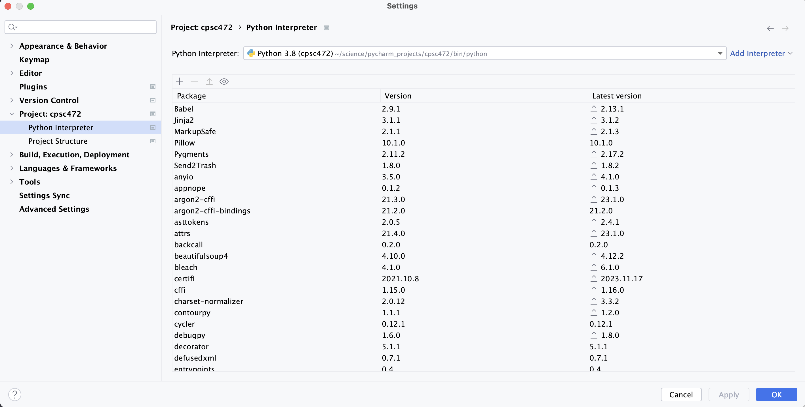
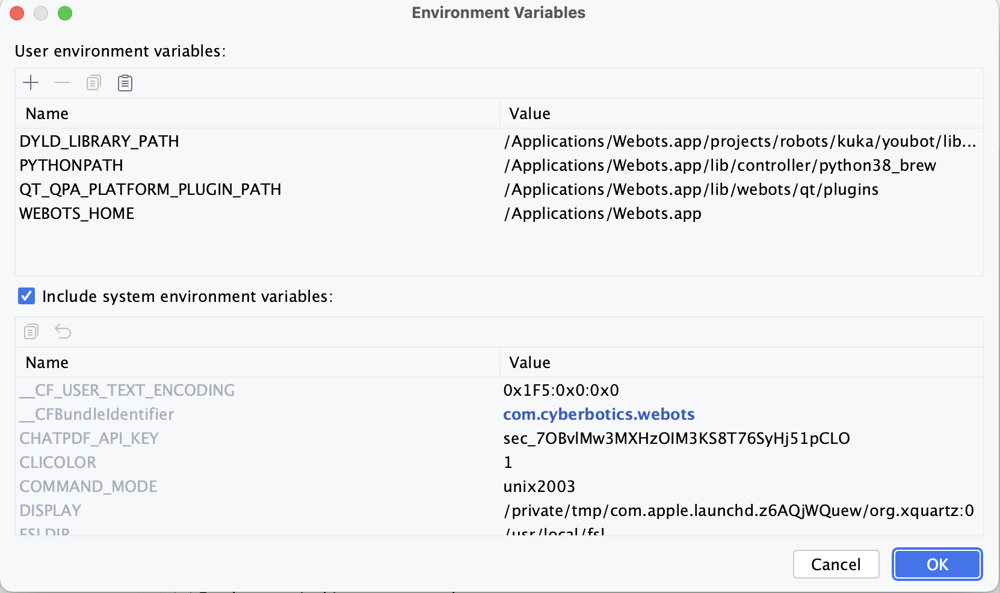
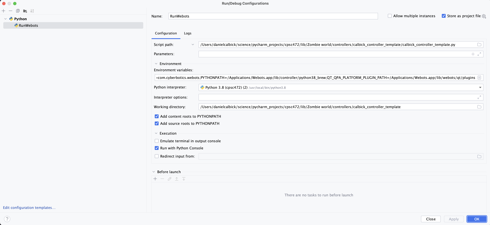
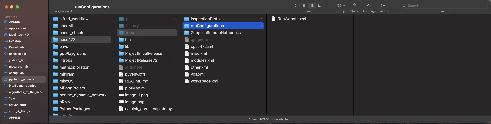
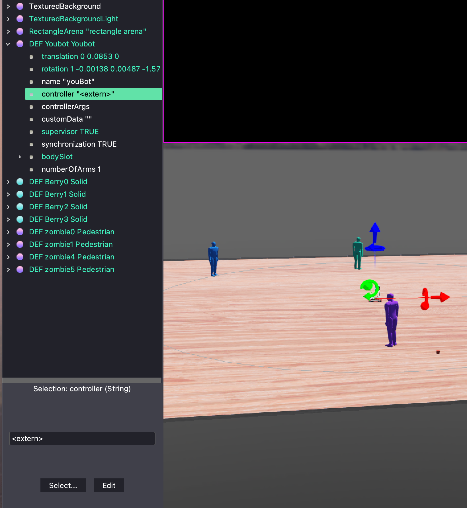
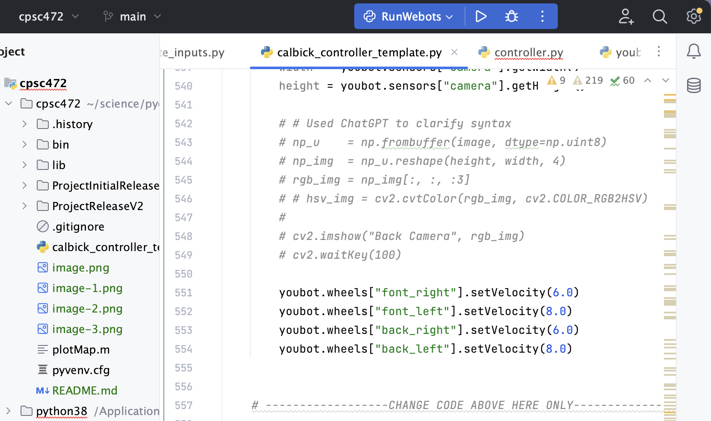

<h1 align="center">CPSC 472 Final Project</h1>

---
## Getting Webots to work with PyCharm
### Useful links:

- [Webots, Using your IDE](https://cyberbotics.com/doc/guide/using-your-ide?tab-os=macos&tab-language=python)
- [Webots, Running and External Controller](https://cyberbotics.com/doc/guide/running-extern-robot-controllers?version=R2021b&tab-language=python&tab-os=macos)

So you can get Pycharm from [JetBrains](https://www.jetbrains.com/community/education/#students) for free if you have a student email; I think there is just a slight email and verification process.

Once you have PyCharm installed you can open the project folder in Pycharm with the base directory being the repo folder from GitHub. The scripts that I have been working with are all in the lib/ folder and the binaries are in the bin/ folder.

---
## To start off there are some things in settings that you have to do:
#### 1. Go to PyCharm > Settings -> Project: 472-Final-Project
   -Make sure that the project interpreter is set to Python 3.8 in 472-Final-Project/bin/python

#### 2. Set up the Profiler; Run > Edit Configurations ... > + > Python Profiler
>- Name it whatever you want
>- Script: (the controller file that you want to run this with) e.g. im using it with 472-Final-Project/lib/Zombie World/controllers/calbick_controller_template/calbick_controller_template.py
>- Now we have to set some environment variables so that the controller can find the webots library
>> Click the little icon to the left of the Environment Variables text box and a window like this will appear:

>>> We need to set these variables (bolded portions should be replaced with your own path to the project folder):
>>> - WEBOTS_HOME=/Applications/Webots.app
>>> - 
>>>LD_LIBRARY_PATH=DYLD_LIBRARY_PATH=/Applications/Webots.app/projects/robots/kuka/youbot/libraries/youbot_control:**/Users/danielcalbick/science/pycharm_projects/cpsc472**/lib/Zombie world/libraries/youbot_control:**/Users/danielcalbick/science/pycharm_projects/cpsc472**/lib/Zombie world/controllers/validate_inputs:/Applications/Webots.app/lib/controller
>>> - PYTHONPATH=/Applications/Webots.app/lib/controller/python38_brew
>>> - PATH=/Applications/Webots.app/bin:$PATH
>>> - QT_QPA_PLATFORM_PLUGIN_PATH=/Applications/Webots.app/lib/webots/qt/plugins
>- We need to set the Python interpreter to the **intell version of python we put in the Webots python interpreter path**: /usr/local/bin/python3.8
>- Set the working directory to the directory of the controller file you are running; I also checked the box to add content roots to PYTHONPATH, which I think helps with finding all the other zombie controller files
>- OK  

> NOTE: I saved this configuration by checking the "stoe as project file" box and saving it in the .idea/runConfigurations folder so that it can be shared with the rest of the team, you should just be able to add it but I wanted to let you know the process
>> Also, my directory git is linked to "cpsc472/" so if you see this in a path it would be the "472-Final-Project/" folder in the repo if you just pulled straight from GitHub

#### 3. The last thing we need to change is the Webots controller within the Youbot note in the scene tree
>- Open the scene tree and click on the youbot node
>- In the properties window on the right, click on the "Controller" and in the smaller dropdown menu select **\<extern>**, this should already be selected if you loaded the world file from the lib/Zombie world/worlds/zombiesAndBerries.wbt but I'm not entirely sure 
#### 3. Now you should be able to run the controller file with the profiler 
> - Run > Profile 'calbick_controller_template' or simply click the play button in the blue profiler box 
> > This will start a python console and run the code initializing python 
> - You won't have control of the console until you click the play button in Webots to start the simulation
##### 3.1 A note on Pycharm
There is a mode called "Scientific Mode" which is a useful way to run this for a couple reasons:
- It has a built in console that you can use to run commands and see the output
- It has a built in variable viewer that you can use to see the values of variables in the program
- You can run the program line by line or in code blocks like in matlab by insterting #%% in the code; this allows you to run the block of code by pressing the green play button next to the block declaration
#### 4. Now you can run the controller in Webots in an interactive way
> - I have been using the sanbox I put at the bottom of the controller file to test things out
> ```python
>[591]    #%% ----------- Sandbox -----------
>[592]
>[593]     world_map = worldMapObject()
>[594]
>[595]     # Initialize youbot in world with sensors
>[596]     youbot   = init_youbot(world_map)
>[597]     robot    = youbot.wb_robot
>[598]     timestep = world_map.timestep
>[599]     
>[600]     passive_wait(0.1, robot, timestep)
>[601]     pc = 0
>[602]     timer = 0
>[603]     
>[604]     robot_node = robot.getFromDef("Youbot")
>[605]     trans_field = robot_node.getField("translation")
>[606]     
>[607]     get_all_berry_pos(robot)
>[608]     
>[609]     #%%
>[610]     
>[611]     tmp = robot.step(TIME_STEP)
>[612]     youbot.sensors["gps"].getValues()
>```
>- The first time the controller runs through it will move one time step in the simulation and you will have full control through the console. Running the code block at ```[609]``` is an example of a simple use case, runing a time step and getting the gps values from the youbot. You can run this block over and over again to see how the gps values change as the youbot moves around the world.
>- *Further*, you can still use the Webots interface to move the youbot around and interact with the world. The console will still be active and you can run the code block at ```[609]``` to see how the gps (or any other sensor) values change as you move the youbot around the world. This is how I plan to build the image processing piece because I can put the youbot right infront of whatever I want, and read the sensor value playing around with the data in PyCharm's console and variable viewer.
> <br>

---
<p>
Let me know if you guys have any issues with the setup or if you have any questions about how to use PyCharm. I think this will be a really useful tool for us to use to develop the controller and I hope you guys can get it working on your machines.
</p>

---


